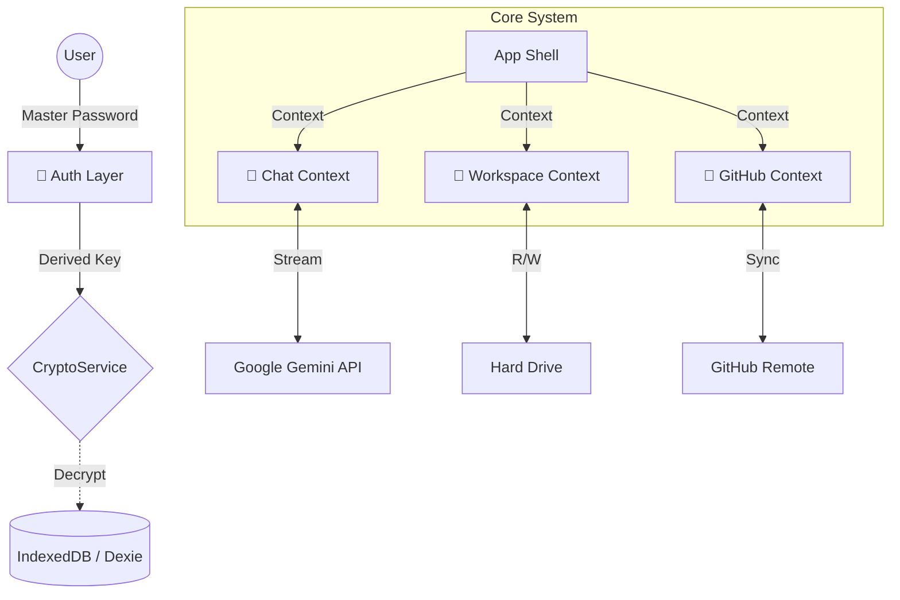

# Tessy "Tesseract" (v4.6.0)
**Rabelus Lab's Private Cognitive Expansion (AGI Node)**


> "A Tessy não é apenas um editor de código. É um **Córtex Externo**. Uma extensão cognitiva projetada para transformar o Rabelus Core em uma AGI Privada e Proprietária." — *Manifesto Antigravity*

---

## 🌌 O Que é a Tessy?

A Tessy é uma plataforma de **Hiper-Engenharia Assistida por IA**, construída com uma arquitetura **Local-First**, **Glassmorphic** e **Molecular**. Ela integra o poder do **Google Gemini 2.0 Pro** diretamente no seu fluxo de trabalho de desenvolvimento, com soberania total de dados.

### Diferenciais do Tesseract (v4.6):
*   **🔒 Segurança Soberana**: Criptografia AES-256 derivada de senha mestra local (Zero-Trust). Suas chaves de API nunca tocam nossos servidores, pois *não temos servidores*.
*   **🧠 Memória Associativa**: Contexto contínuo via `IndexedDB` e `FileSystemHandle`. A Tessy "lembra" do seu projeto inteiro localmente.
*   **💎 Design LiquidGlass**: Uma interface futurista, fluida e imersiva (`backdrop-filter: blur(16px)`), projetada para induzir estado de Flow.
*   **⚡ Terminal Quântico**: Execução de código real via `node-pty` e `xterm.js` no backend local.

---

## 🧬 Arquitetura Molecular

O sistema opera sob a **Lei da Molecularidade**, onde cada componente é uma célula independente, mas interconectada.



---

## 🚀 Funcionalidades Principais

### 1. **CoPilot "Antigravity"**
O coração da Tessy. Um assistente de chat contextual que entende todo o seu projeto.

*   **Multi-Modal**: Aceita texto, imagens e arquivos.
*   **Typewriter UX**: Respostas com cadência humana para melhor leitura cognitiva.
*   **Auto-Scroll & Markdown**: Renderização rica de código com syntax highlighting.

### 2. **Soberania de Dados (Local-First)**
Tudo reside na sua máquina (`c:\Dev_Room`).
*   **Sem Nuvem Intermediária**: A comunicação é Direta (Sua Máquina <-> Google API).
*   **Persistência Offline**: Projetos, histórico de chat e configurações salvos em `IndexedDB`.

### 3. **Gestão de Projetos Ágil**
*   **Workspaces Isolados**: Alternância rápida entre múltiplos repositórios.
*   **Git Integrado**: Clone, Pull, Push e Sync sem sair da interface.

### 4. **Ecosistema Visual**
*   **Temas Dinâmicos**: Dark/Light com suporte a sintonização de cores de acento.
*   **Modais de Vidro**: Interfaces flutuantes que não perdem o contexto de fundo.

---

## 🛠️ Instalação e Execução

### Pré-requisitos
*   Node.js v20+
*   Navegador Moderno (Chrome/Edge v120+)

### Quick Start
```bash
# 1. Clone o repositório
git clone https://github.com/rabelojunior81/tessy-antigravity-rabelus-lab.git

# 2. Instale as dependências
npm install

# 3. Inicie o Núcleo (Frontend + Backend)
npm start
```
Acesse em: `http://localhost:3000`

---

## 📜 Histórico de Versões (Timeline)

| Versão | Codename | Status | Destaque |
| :--- | :--- | :--- | :--- |
| **v4.6.0** | **Tesseract** | 🟢 **Current** | Segurança Master Password, Limpeza de Código, Rebranding. |
| v3.3.0 | Antigravity | 🟡 Legacy | Integração Terminal, Refatoração Estilo. |
| v2.1.0 | Genesis | 🔴 Deprecated | POC Inicial, Dexie implementation. |

---

## 🛡️ Protocolo de Segurança (TSP)

A partir da v4.6.0, o **Tessy Safety Protocol (TSP)** exige:
1.  **Nunca** commitar chaves de API.
2.  **Sempre** utilizar a Senha Mestra para descriptografar o cofre local.
3.  **Auditoria Contínua**: O código é aberto para inspeção e auditoria visual constante.

---
*© 2025-2026 Rabelus Lab. All Rights Reserved. Built for the Future.*