# Tessy "Tesseract" (v4.6.1)
**Rabelus Lab's Private Cognitive Expansion (AGI Node)**

> "A Tessy não é apenas um editor de código. É um **Córtex Externo**. Uma extensão cognitiva projetada para transformar o Rabelus Core em uma AGI Privada e Proprietária." — *Manifesto Antigravity*

---

## 🌌 O Que é a Tessy?

A Tessy é uma plataforma de **Hiper-Engenharia Assistida por IA**, construída com uma arquitetura **Local-First**, **Glassmorphic** e **Molecular**. Ela integra o poder do **Modelo Agnostico (Atualmente Gemini 2.0 Flash Exp)** diretamente no seu fluxo de trabalho.

### Diferenciais do Tesseract (v4.6):
*   **🔒 Segurança Soberana**: Criptografia AES-256 derivada de senha mestra local (Zero-Trust).
*   **🧠 Memória Associativa**: Contexto contínuo via `IndexedDB` e `FileSystemHandle`.
*   **💎 Design LiquidGlass**: Uma interface futurista, fluida e imersiva (`backdrop-filter: blur(16px)`).
*   **⚡ Terminal Quântico**: Execução de código real via `node-pty`.

---

## 🧬 Arquitetura Molecular

O sistema opera sob a **Lei da Molecularidade**, onde cada componente é uma célula independente, mas interconectada.

```mermaid
graph TD
    User((User)) -->|Master Password| AuthLayer[🔐 Auth Layer]
    AuthLayer -->|Derived Key| CryptoService{CryptoService}
    CryptoService .->|Decrypt| LocalDB[(IndexedDB / Dexie)]
    
    subgraph "Core System"
        App[App Shell] -->|Context| Chat[🤖 Chat Context]
        App -->|Context| FS[📂 Workspace Context]
        App -->|Context| Git[🐙 GitHub Context]
    end

    Chat <-->|Stream| GeminiAPI[LLM Agnostic API]
    FS <-->|R/W| LocalFS[Hard Drive]
    Git <-->|Sync| GitHubAPI[GitHub Remote]
```

---

## 🚀 Funcionalidades Principais

### 1. **CoPilot "Antigravity"**
O coração da Tessy. Um assistente de chat contextual que entende todo o seu projeto.
*   **Multi-Modal**: Aceita texto, imagens e arquivos.
*   **Typewriter UX**: Respostas com cadência humana.
*   **Auto-Scroll & Markdown**: Renderização rica de código.

### 2. **Terminal Quantico**
Shell real integrado com `node-pty` e `xterm.js`.
*   **Conexão Real**: PowerShell/Bash via WebSocket.
*   **Transparência LiquidGlass**: Fundo translúcido integrado.

### 3. **Gestão de Projetos Ágil**
*   **Workspaces Isolados**: Alternância rápida entre múltiplos repositórios.
*   **Git Integrado**: Clone, Pull, Push e Sync.

---

## 📜 Histórico de Versões (Timeline)

| Versão | Codename | Status | Destaque |
| :--- | :--- | :--- | :--- |
| **v4.6.1** | **Tesseract** | 🟢 **Current** | Purge de Alucinações, Model Agnostic Core, Saneamento Documental. |
| v3.3 -> v4.5 | The Lost Era | 🟣 **Archived** | Período de evolução rápida e indocumentada. |
| v3.2.4 | Antigravity | 🟡 Legacy | Integração Terminal, Refatoração Estilo. |
| v2.1.0 | Genesis | 🔴 Deprecated | POC Inicial, Dexie implementation. |

---

## 🛡️ Protocolo de Segurança (TSP)

A partir da v4.6.0, o **Tessy Safety Protocol (TSP)** exige:
1.  **Nunca** commitar chaves de API.
2.  **Sempre** utilizar a Senha Mestra para descriptografar o cofre local.
3.  **Auditoria Contínua**: O código é aberto para inspeção e auditoria visual constante.

---
*© 2025-2026 Rabelus Lab. All Rights Reserved. Built for the Future.*